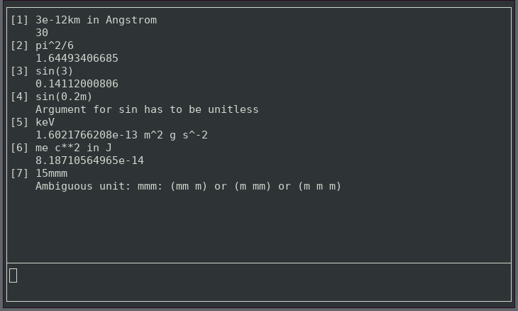

# UnitParser
A parser for mathematical expressions with units, written in pure Python 3. It takes a string as input and returns the number that it represents, including any unit. A given expression can also be expressed in terms of another one, resulting in an numerical value.

All allowed units a read from a configuration file, that can be easily extended. Additional mathematical expressions can also be added. The default config supports only SI units.

It also comes with a simple curses based interfaced, that can be used as a simple calculator.

<p align="center"></p>

## Usage
Minimal example:
```
$ python3
>>> import unitparser
>>> unitparser.in_units_of("3m+4mm", "cm")
300.4
>>> unitparser.in_units_of("c", "km/s")
299792.458
```
For a more detailed example, see `unitparser/example.py`

## Installation
To install system wide, add these lines to your `.bashrc`:
<pre>
export PYTHONPATH=<i>path/to/repository</i>:$PYTHONPATH
alias units='python3 -c "from unitparser import ui; ui.main()"'
</pre>
Afterwards type `units` to launch the UI.

## License
This project licensed under the GNU General Public License v3.
